# Self-driving Vehicle Algorithm Analysis（各项算法分析）


<video src='video/load tracking.mp4' width=360/> 

<video src='video/load motion planner.mp4' width=360/>


[TOC]
- [Self-driving Vehicle Algorithm Analysis（各项算法分析）](#self-driving-vehicle-algorithm-analysis（各项算法分析）)
  - [前言](#前言)
  - [一、运动控制](#一、运动控制)
    - [1.1 纵向控制算法](#11-纵向控制算法)
    - [1.2 横向控制算法](#12-横向控制算法)
      - [1.2.1 Pure pursuit（后轴定位）](#121-pure-pursuit（后轴定位）)
      - [1.2.2 Stanley](#122-stanley)
    - [1.3 控制算法代码](#13-控制算法代码)
  - [二、位姿估计与定位](#二、位姿估计与定位)
    - [2.1 卡尔曼滤波](#21-卡尔曼滤波)
    - [2.2 Error-State 卡尔曼滤波](#22-error-state-卡尔曼滤波)
    - [2.3 传感器](#23-传感器)
    - [2.4 姿态估计代码](#24-姿态估计代码)
      - [2.4.1轨迹预测（EKF-Lab）](#241轨迹预测（ekf-lab）)
      - [2.4.2车辆路面状态估计（ES-EKF-Lab）](#242车辆路面状态估计（es-ekf-lab）)
  - [三、视觉感知](#三、视觉感知)
    - [3.1 坐标转换](#31-坐标转换)
    - [3.2 图像滤波（略）](#32-图像滤波（略）)
    - [3.3 相机标定](#33-相机标定)
    - [3.3 图像真实坐标计算](#33-图像真实坐标计算)
    - [3.4 神经网络（模型训练，物体识别，语义分割）](#34-神经网络（模型训练，物体识别，语义分割）)
    - [3.5 视觉里程计定位代码](#35-视觉里程计定位代码)
  - [四、运动规划](#四、运动规划)
    - [4.1 地图构建](#41-地图构建)
    - [4.2 路径规划（Route planning）](#42-路径规划（route-planning）)
    - [4.3 行为规划（behavior planning)](#43-行为规划（behavior-planning)
    - [4.4 运动预测(轨迹预测、碰撞预测)](#44-运动预测轨迹预测、碰撞预测)
    - [4.5 局部路径规划](#45-局部路径规划)
    - [4.6 运动规划代码](#46-运动规划代码)


## 前言

由于计算机视觉方向的重大突破，计算能力的提高，近十年来，自动驾驶方向成为了其衍生出来的一个研究分支。自动驾驶火于计算机视觉，但又不仅仅局限在计算机视觉。本文讲从汽车的运动控制，位置与状态的估计，汽车感知以及路径规划四个方面讲述所采用到的算法，并结合代码便于理解。

~~自动驾驶由于应用在人们出行普遍使用的汽车当中，其安全性不言而喻，因此考虑到安全性，其相关的算法从设计到落地都需要严谨的验证~~

## 一、运动控制

汽车的运动包括两个方面，纵向与横向。运动控制主要考虑两个方面：舒适性和准确性。纵向控制涉及到的量是汽车的速度、加速度、油门、刹车，控制的过程涉及四个状态量的转换，舒适性体现在汽车的加速减速尽可能平滑，准确性体现在汽车是否在预定的位置达到预定的状态。而横向的控制算法，则体现在汽车的偏航的角速度上，角速度越大，说明方向盘打得越急促，角速度越小，方向盘转动越平缓。

### 1.1 纵向控制算法

纵向控制的主要算法为PID控制算法，PID三个字母表示其控制的量由线性，积分和微分三个项来表示。

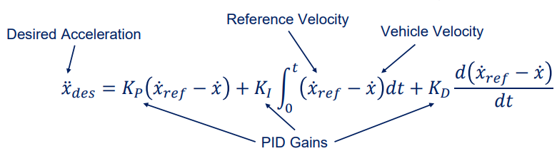

汽车的控制过程如下所示：

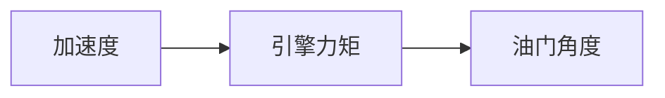

A-->B的过程使用车辆传动系统动力学模型：

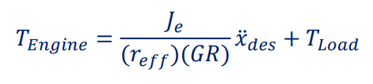

B-->C的过程则需要一个实际测量的数据，并构建一个力矩--转速--油门速度相关的转换图：

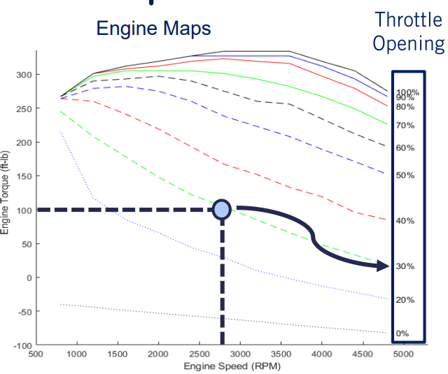

控制效果如下：

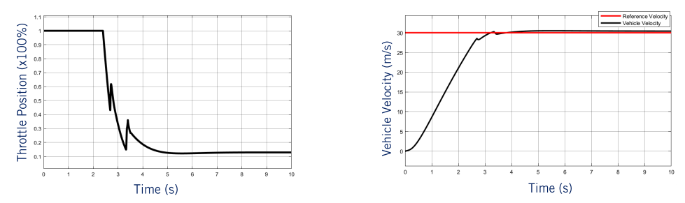

代码分析：

```python
        kp = 1
        ki = 1
        kd = 0.01
        # Skip the first frame to store previous values properly
        if self._start_control_loop:
            throttle_output = 0
            brake_output    = 0

            # pid control
            st = t - self.vars.t_previous

            # error term
            delta_v = v_desired - v

            # I
            integral = self.vars.int_val + delta_v * st

            # D
            derivate = (delta_v - self.vars.last_error) / st
			self.vars.last_error = delta_v
            
            rst = kp * delta_v + ki * integral + kd * derivate

            if rst > 0:
                throttle_output = np.tanh(rst)
                throttle_output = max(0.0, min(1.0, throttle_output))
                if throttle_output - self.vars.throttle_previous > 0.1:
                    throttle_output = self.vars.throttle_previous + 0.1
            else:
                throttle_output = 0
                
                
        self.vars.v_previous = v  # Store forward speed to be used in next step
        self.vars.t_previous = t
        self.vars.int_val = integral
        self.vars.throttle_previous = throttle_output
        self.vars.last_error = delta_v
```


### 1.2 横向控制算法

横向控制算法用于控制车辆回到既定轨道，确保不偏航。主要算法有Pure pursuit， Stanly，MPC。有关原理，这里解释前两种。

#### 1.2.1 Pure pursuit（后轴定位）

汽车转向角δ

车身长度L

车辆行驶方向与轨迹预瞄点夹角α

预瞄距离$$l_d$$（后轴到预瞄轨迹点的距离）

这里，预瞄距离可以改为与速度成为正比的函数，即$$l_d = k * v$$， 使得车辆在高速时保持稳定性，不至于转向角突然变大

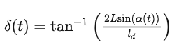

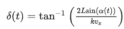

#### 1.2.2 Stanley

Stanley也同样权衡了稳定性和精确性。对于汽车的转向角其使用两项构成

$$\theta_e(t)$$表示角度误差，衡量当前角度与轨道上应设角度的误差

第二项是距离误差，衡量车辆与轨道的两条切线之间的误差


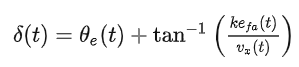

### 1.3 控制算法代码

```python
# pure pursuit
L = 1.5 * 2
k = 0.5
l_d = k * v + l_d
#利用两个点算出夹角和距离，然后直接套用转换公式
alpha = np.arctan((self._waypoints[-1][1] - self._current_y) / (self._waypoints[-1][0] - self._current_x))
l_d = np.linalg.norm(np.array([
    self._waypoints[0][0] - self._current_x,
    self._waypoints[0][1] - self._current_y]))
delta = np.arctan(2 * L * np.sin(alpha) / l_d)


# Stanley
# Use stanley controller for lateral control
# 0. spectify stanley params
k_e = 0.3
k_v = 10

# 1. calculate heading error
yaw_path = np.arctan2(waypoints[-1][1]-waypoints[0][1], waypoints[-1][0]-waypoints[0][0])
yaw_diff = yaw_path - yaw 
if yaw_diff > np.pi:
    yaw_diff -= 2 * np.pi
    if yaw_diff < - np.pi:
        yaw_diff += 2 * np.pi

# 2. calculate crosstrack error
current_xy = np.array([x, y])
crosstrack_error = np.min(np.sum((current_xy - np.array(waypoints)[:, :2])**2, axis=1))

#yaw_cross_track = np.arctan2(y-waypoints[0][1], x-waypoints[0][0])
#yaw_path2ct = yaw_path - yaw_cross_track
#if yaw_path2ct > np.pi:
#    yaw_path2ct -= 2 * np.pi
#if yaw_path2ct < - np.pi:
#    yaw_path2ct += 2 * np.pi
#if yaw_path2ct > 0:
#    crosstrack_error = abs(crosstrack_error)
#else:
#    crosstrack_error = - abs(crosstrack_error)
#
#yaw_diff_crosstrack = np.arctan(k_e * crosstrack_error / (k_v + v))

#print(crosstrack_error, yaw_diff, yaw_diff_crosstrack)
#print(crosstrack_error, yaw_diff, yaw_diff_crosstrack)

# 3. control low
steer_expect = yaw_diff + yaw_diff_crosstrack
if steer_expect > np.pi:
    steer_expect -= 2 * np.pi
if steer_expect < - np.pi:
    steer_expect += 2 * np.pi
steer_expect = min(1.22, steer_expect)
steer_expect = max(-1.22, steer_expect)

# 4. update
steer_output = steer_expect
```


## 二、位姿估计与定位

车辆的位置状态一般使用车辆的上一个状态和传感器测量到的数据进行融合估计，而将两者进行融合的方法叫做卡尔曼滤波器，这个滤波器为线性滤波器，但是对于非线性的问题，也可以采用近似的方法，得到一个延申的办法--扩展卡尔曼滤波器。只有在准确地估算出汽车的当前状态，才能对未来有效地规划。若估算的位置偏差太大，其危险性不言而喻

### 2.1 卡尔曼滤波

卡尔曼滤波器分为两个阶段估计汽车的状态。

- 预测阶段，使用运动模型，即通过运动学公式，从汽车的前一个状态量，估计出当前的状态量- 

- 纠正阶段，使用测量模型，即通过传感器的实时数据，纠正预测阶段的状态量

下面是简单的推导解释：

车辆的状态量 $$x_t = [p_t  v_t]^T$$, 分别是位置p和速度v

 运动学关系如下：
$$
 p_t = p_{t-1} + v_{t-1} * \Delta t + a_t × (\Delta t ^2 / 2) \\
 v = v_{t-1} + a_t × \Delta t
$$
有关的系数提取出来，写成：
$$
\begin{bmatrix} p_t \\ v_t \end{bmatrix}
= 
\begin{bmatrix} 1 & \Delta t \\ 0 & 1 \end{bmatrix}
\begin{bmatrix} p_{t-1} \\ v_{t-1} \end{bmatrix} 
+ 
\begin{bmatrix} \Delta t^2/2 \\ \Delta t \end{bmatrix} a_t
$$
即
$$
\hat{x_t^-} = F_t\hat{x}_{t-1} + B_ta_t
$$

F称为状态转移矩阵，表示上一时刻与这一时刻的**推测关系**

B称为控制矩阵，表示控制量 a（加速度）如何作用于当前状态

------

到这里，我们初步得到一个状态量的估计值，那么如何衡量这个值的不确定性呢？换句话说，我怎么知道这个估计的值的误差范围有多大呢？一个汽车的位置(x, y) =（100±0.5， 50±0.5）和（100 ± 5， 50 ± 5）两种估计可是对决策产生很大的影像。所以给出一个衡量的指标：P协方差矩阵

P矩阵的关系如下：
$$
P_t^- = FP_{t-1}F^T + Q
$$
它与前一个状态的关系只需要再乘上转换矩阵即可，而这个估计本身包含噪声，所以加一个不确定的矩阵Q

运动学关系推导完，剩下传感器的观测

观测值和汽车的位置存在一个线性的关系，我们用观测矩阵H来表示

则观测值Z有
$$
z_t = Hx_t + v
$$
这样的观测存在噪声，加一个不确定协方差矩阵R

------

有了观测值，就对状态量进行更新

更新关系如下：
$$
\hat{x_t} = \hat{x_t}^- + K_t(z_t-H\hat{x}_t^-)\\
K_t = P_t^-H^T(HP_t^-H^t+R)^{-1}
$$
即上一个状态量 = 运动学推断的预测值 + 观测值与预测值的残差

K：卡尔曼增益系数，它的大小决定当前时刻状态量是相信预测值多一点还是观测值多一点

而K推导出和协方差矩阵，观测矩阵有关，说明它可以联系各个状态量之间的关系

-----

最后是协方差矩阵的更新
$$
 P_t = (I - K_t H )P_t^-
$$

### 2.2 Error-State 卡尔曼滤波

$$
x = \hat{x} + \delta x
$$

在此不再赘述，后面使用ppt+代码的形式来解释该过程的状态更新

这是卡尔曼滤波器的变种，其运用在车辆的原因是

- 能够解决三维空间的旋转问题
- 使用error state来纠正nominal state


### 2.3 传感器

- 激光雷达（Lidar）

输出点云数据，主要用于建图

- 惯性测量单元 / 陀螺仪（IMU）

输出6个数据，三个正交的加速度，三个正交的角速度

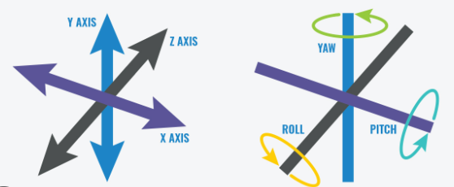

- 全球定位系统（GNSS）

输出车辆坐标

### 2.4 姿态估计代码

#### 2.4.1轨迹预测（EKF-Lab）

- 参数初始化，这个步骤关系到后面的预测，如果设置不合理，影响很大，特别是协方差矩阵相关的参数，影响到对不确定性的权重

```python
v_var = 0.01  # translation velocity variance  
om_var = 0.01  # rotational velocity variance 
r_var = 0.1  # range measurements variance
b_var = 0.01  # bearing measurement variance
# 修改后的参数
b_var = 0.1  # bearing measurement variance
om_var = 1  # rotational velocity variance 

Q_km = np.diag([v_var, om_var]) # input noise covariance 
cov_y = np.diag([r_var, b_var])  # measurement noise covariance 

x_est = np.zeros([len(v), 3])  # estimated states, x, y, and theta
P_est = np.zeros([len(v), 3, 3])  # state covariance matrices

x_est[0] = np.array([x_init, y_init, th_init]) # initial state
P_est[0] = np.diag([1, 1, 0.1]) # initial state covariance
```


- 预测阶段，给到的输入参数是线速度和角速度（按理来说是不可能在IMU中读到的）

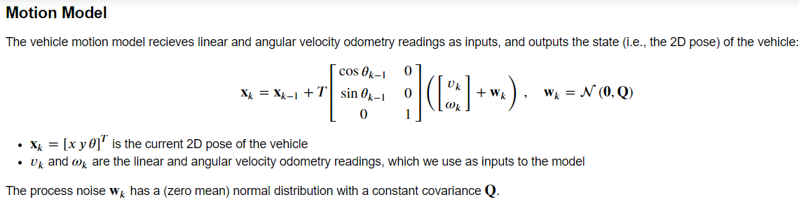

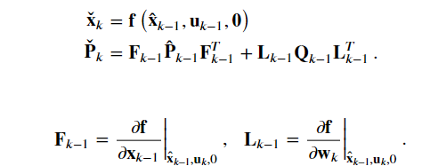

```python
#### 5. Main Filter Loop #######################################################################
for k in range(1, len(t)):  # start at 1 because we've set the initial prediciton

    delta_t = t[k] - t[k - 1]  # time step (difference between timestamps)
    x_check = np.zeros((3,))
    x_check[0] = x_est[k-1, 0]
    x_check[1] = x_est[k-1, 1]
    x_check[2] = x_est[k-1, 2]
    
    P_check = P_est[k-1, :, :]
    # 1. Update state with odometry readings (remember to wrap the angles to [-pi,pi])
    T_mat = delta_t * np.mat([[np.cos(x_check[2]), 0],
                              [np.sin(x_check[2]), 0],
                              [0, 1]])
    x_k = np.mat([[v[k]], [om[k]]])
    add = T_mat*x_k
    add = np.array(add).reshape((3,))
    x_check = x_check + add
    x_check[2] = wraptopi(x_check[2])
    # 2. Motion model jacobian with respect to last state
    F_km = np.mat([[1,0,-delta_t*v[k-1]*np.sin(x_check[2])],
                   [0,1,delta_t*v[k-1]*np.cos(x_check[2])],
                   [0,0,1]])
    # 3. Motion model jacobian with respect to noise
    L_km = np.mat([[delta_t*np.cos(x_check[2]), 0],
                   [delta_t*np.sin(x_check[2]), 0],
                   [0, delta_t]])
    # 4. Propagate uncertainty  (协方差矩阵和噪声矩阵的更新)
    P_check = F_km*P_check*F_km.T + L_km*Q_km*L_km.T
    # 5. Update state estimate using available landmark measurements
    for i in range(len(r[k])):
        x_check, P_check = measurement_update(l[i], r[k, i], b[k, i], P_check, x_check)

```

- 纠正阶段

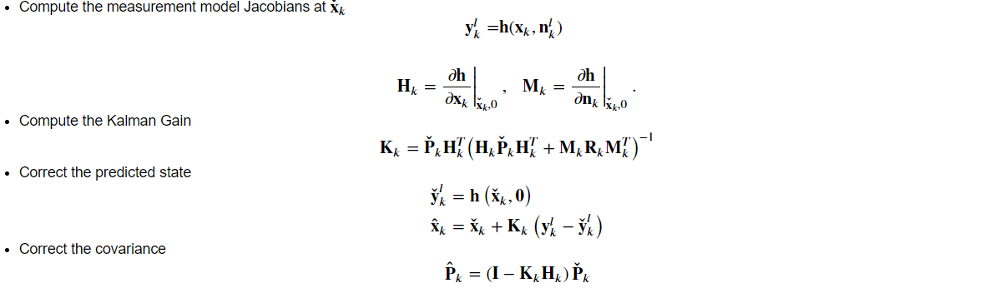

```python
def measurement_update(lk, rk, bk, P_check, x_check):
#     print(x_check.shape)
    x_k = x_check[0]
    y_k = x_check[1]
    theta_k = wraptopi(x_check[2]) #限制在-pi到pi之间
    
    #l就是每个时刻的landmark的坐标信息
    x_l = lk[0] 
    y_l = lk[1]
    
    #这个就是三角形的两条边
    d_x = x_l - x_k - d*np.cos(theta_k)
    d_y = y_l - y_k - d*np.sin(theta_k)
    #两点的距离 以及 夹角Φ
    r = np.sqrt(d_x**2 + d_y**2)
    phi = np.arctan2(d_y, d_x) - theta_k
    
    # 1. Compute measurement Jacobian
    # Jacobian matrix 是y的矩阵对所有的x求偏导，题中y有两个，r和Φ， x是【x,y,θ】，所以shape = 【2x3】
    H_k = np.zeros((2,3))
    H_k[0,0] = -d_x/r
    H_k[0,1] = -d_y/r
    H_k[0,2] = d*(d_x*np.sin(theta_k) - d_y*np.cos(theta_k))/r
    H_k[1,0] = d_y/r**2
    H_k[1,1] = -d_x/r**2
#     H_k[1,2] = -1-d*(d_y*np.sin(theta_k) + d_x*np.cos(theta_k))/r**2
    H_k[1,2] = (-(y_l-y_k)*d*np.cos(theta_k)-(x_k-x_l)*d*np.sin(theta_k)) / (r**2+1) - 1
#     H_k[1,2] = 0
    #方差矩阵，是个单位矩阵，为1的原因应该是测量的方差为常数
    M_k = np.identity(2)
    
    y_out = np.vstack([r, wraptopi(phi)])  #垂直方向拼接， y_mes -> y   y_out -> 测量得到得 y
    y_mes = np.vstack([rk, wraptopi(bk)])  #因为这里的landmark 只有一个，所以rk,bk也是只有一个数，不是原始的八个

    # 2. Compute Kalman Gain
    K_k = P_check @ H_k.T @ np.linalg.inv(H_k @ P_check @ H_k.T + M_k @ cov_y @ M_k.T)
    
    # 3. Correct predicted state (remember to wrap the angles to [-pi,pi])
    gain = K_k @ (y_mes - y_out)
    gain = np.squeeze(gain)
#     print(gain.shape)
    x_check = x_check + gain
    x_check = np.ravel(x_check)
#     print(x_check.shape)
    x_check[2] = wraptopi(x_check[2])
    
    # 4. Correct covariance [3x3]代表x,y,Θ的方差
    P_check = (np.identity(3) - K_k @ H_k) @ P_check

    return x_check, P_check
```

#### 2.4.2车辆路面状态估计（ES-EKF-Lab）

任务：

1. 轨道估计
2. 传感器校准失败，通过改变噪声方差以降低该传感器的权重估计
3. 传感器失灵

```python
for k in range(1, imu_f.data.shape[0]):  # start at 1 b/c we have initial prediction from gt
    delta_t = imu_f.t[k] - imu_f.t[k - 1]
    C_ns = Quaternion(*q_est[k - 1]).to_mat() #兩個參考系之間的rotation matrix
    
    # 1. Update state with IMU inputs
    p_est[k] = p_est[k-1] + delta_t * v_est[k-1] + 0.5 * delta_t ** 2 * (C_ns @ imu_f.data[k-1] + g)
    v_est[k] = v_est[k-1] + delta_t * (C_ns @ imu_f.data[k-1] + g)
    q_est[k] = Quaternion(euler = imu_w.data[k-1] *delta_t).quat_mult_right(q_est[k-1])
    
    # 1.1 Linearize the motion model and compute Jacobians  (狀態轉換矩陣F)
    F_k = np.eye(9)
    F_k[0:3, 3:6] = delta_t * np.eye(3)
    F_k[3:6, 6:9] = - skew_symmetric(C_ns @ imu_f.data[k-1]) * delta_t
    
    # 2. Propagate uncertainty   LQL為測量的誤差矩陣,Qk為常數
    Q = Q_k * delta_t **2
    p_cov[k] = F_k @ p_cov[k-1] @ F_k.T + L_k @ Q @ L_k.T
    
    # 3. Check availability of GNSS and LIDAR measurements
    # gnss.t, gnss.t.shape
    # 任务3 测试所有的探测器drop时，需要加入最外层的if条件来模拟
    if k < 0.7 * imu_f.data.shape[0]:
        if(np.in1d(imu_f.t[k], gnss.t)):
            index = np.where(gnss.t == imu_f.t[k])[0][0]
            p_est[k], v_est[k], q_est[k], p_cov[k] = measurement_update(var_gnss, p_cov[k], gnss.data[index], p_est[k], v_est[k], q_est[k])
            
        if(np.in1d(imu_f.t[k], lidar.t)):
            index = np.where(lidar.t == imu_f.t[k])[0][0]
            p_est[k], v_est[k], q_est[k], p_cov[k] = measurement_update(var_lidar, p_cov[k], lidar.data[index], p_est[k], v_est[k], q_est[k])
    # else:
    #     var_gnss  *= 1.01
    #     var_lidar *= 1.01
    # Update states (save)
```

```python
#传感器校准失败
C_li = np.array([
    [ 0.99376, -0.09722,  0.05466],
    [ 0.09971,  0.99401, -0.04475],
    [-0.04998,  0.04992,  0.9975 ]
])

# Incorrect calibration rotation matrix, corresponding to Euler RPY angles (0.05, 0.05, 0.05).
# C_li = np.array([
#       [ 0.9975 , -0.04742,  0.05235],
#       [ 0.04992,  0.99763, -0.04742],
#       [-0.04998,  0.04992,  0.9975 ]
# ])

#通过修改方差参数以降低权重
var_imu_f = 0.10
var_imu_w = 0.25
var_gnss  = 0.01
var_lidar = 1.00
#%%
#tune to get the best state _DC
var_imu_f = 0.10
var_imu_w = 0.25
var_gnss  = 10
var_lidar = 10
# 任务2 for imitate imu's error -> increase its untrust
var_imu_f = 0.10
var_imu_w = 0.25
var_gnss  = 0.01
var_lidar = 36  ## Lidar误差大，需要降低权重
```


## 三、视觉感知

参考链接：

[SLAM入门之视觉里程计(2)：相机模型（内参数，外参数） - Brook_icv - 博客园 (cnblogs.com)](https://www.cnblogs.com/wangguchangqing/p/8126333.html#autoid-0-5-0)

本章主要介绍摄像头Camera，


### 3.1 坐标转换

相机坐标与世界坐标的转换(旋转+平移)
$$
\left[\begin{array}{c}X_c\\Y_c\\Z_c\\1\end{array}\right] = \left[\begin{array}{ccc}R_{11}&R_{12}&R_{13}&t_1\\R_{21}&R_{22}&R_{23}&t_2\\R_{31}&R_{32}&R_{33}&t_3\\0&0&0&1\end{array}\right]\left[\begin{array}{c}X_w\\Y_w\\Z_w\\1\end{array}\right]
 = 
 \left[\begin{array}{cc}R&t\\0^T&1\end{array}\right]\left[\begin{array}{c}X_w\\Y_w\\Z_w\\1\end{array}\right] = T(相机内参)\left[\begin{array}{c}X_w\\Y_w\\Z_w\\1\end{array}\right]
$$


像素坐标与相机坐标的转换
$$
\left[\begin{array}{c}\mu\\\nu\\1\end{array}\right] = \left[
\begin{array}{ccc}f_x&0&c_x\\0&f_y&c_y\\0&0&1\end{array}\right]\left[\begin{array}{c}X_c\\Y_c\\Z_c\end{array}\right]
 = 
 K(相机内参)\left[\begin{array}{c}X_c\\Y_c\\Z_c\end{array}\right]
$$

$$
P = K  T
$$

P通过相机的标定获得（camera calibration）

### 3.2 图像滤波（略）

滤波通过各种算子，如中值，高斯，卷积等，提取图像中的各种信息，如边缘，直线等等，具体算子不再赘述。

### 3.3 相机标定

在未知相机内外惨的情况下，通过下面的等式，解出p

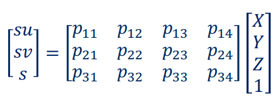

通过N个像素点对应N个三维真实点，建立齐次线性方程

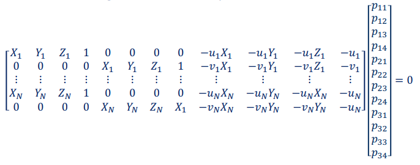

由于P=KT，可以将P矩阵进行QR分解即可。

QR分解例子：

[QR分解_哔哩哔哩_bilibili](https://www.bilibili.com/video/BV1ZY411q75R/?spm_id_from=333.337.search-card.all.click&vd_source=24be587ba4307f8496d0a182b0491855)

### 3.3 图像真实坐标计算

当相机的内外参数校准之后，可以通过对采集到的图像进行特征点的提取，通过连续帧之间的比对来估算目标位置的真实坐标，以及汽车本身的位置。

- 估算目标坐标--视差法：

通过找到双目相机当中对应像素点(极限约束法（Epipolar Constraint）通过比较同一极限的所有像素来匹配)，根据公式推算出，f为焦距，b为双目距离，d为$$x_L - x_R$$

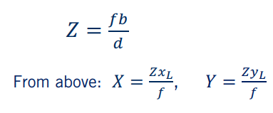

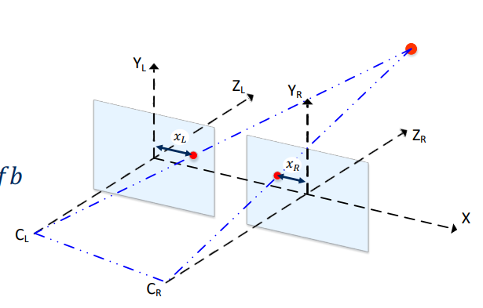


3.4 特征提取与视觉里程计（Visual Odometry)

图像中的特征点如果在连续帧当中能够匹配到，则可以通过匹配的点来估计车辆的移动状态

经典的特征提取方法有：

SIFT、SURF、GLOH、BRIHF、ORB

特征点在两个图像之间匹配的方法可以通过测量其特征向量的平方差，绝对值差、汉明距离来匹配

对于匹配到多个点的情况，则可以设定距离的比率ρ来淘汰某些点

对于错误匹配的点，可以使用RANSAC(**RAN**dom **SA**mple **C**onsensus)做outlier rejection)

- 利用连续帧进行轨迹估算的方法

1. 通过连续帧的特征点不变，来获得相机的运动矩阵T（奇异值分解）

$$
T = \left[\begin{array}{c}R_{k,k-1} & t_{k,k-1} 
						\\0 & 1\end{array}\right]
$$

2. 运动拼接

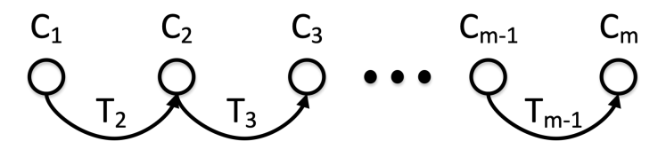

### 3.4 神经网络（模型训练，物体识别，语义分割）

这部分内容在此不作解释


### 3.5 视觉里程计定位代码

通过估计两个时刻的R|t矩阵，求出偏移量t，这个偏移量即车辆在两帧的时间里平移的距离

```python
def estimate_trajectory(estimate_motion, matches, kp_list, k, depth_maps=[]):
    """
    Estimate complete camera trajectory from subsequent image pairs

    Arguments:
    estimate_motion -- a function which estimates camera motion from a pair of subsequent image frames
    matches -- list of matches for each subsequent image pair in the dataset. 
               Each matches[i] is a list of matched features from C:\Users\a\AppData\Roaming\Typora\typora-user-images i and i + 1
    des_list -- a list of keypoints for each image in the dataset
    k -- camera calibration matrix 
    
    Optional arguments:
    depth_maps -- a list of depth maps for each frame. This argument is not needed if you use Essential Matrix Decomposition

    Returns:
    trajectory -- a 3xlen numpy array of the camera locations, where len is the lenght of the list of C:\Users\a\AppData\Roaming\Typora\typora-user-images and   
                  trajectory[:, i] is a 3x1 numpy vector, such as:
                  
                  trajectory[:, i][0] - is X coordinate of the i-th location
                  trajectory[:, i][1] - is Y coordinate of the i-th location
                  trajectory[:, i][2] - is Z coordinate of the i-th location
                  
                  * Consider that the origin of your trajectory cordinate system is located at the camera position 
                  when the first image (the one with index 0) was taken. The first camera location (index = 0) is geven 
                  at the initialization of this function

    """
#     trajectory = np.zeros((3, 1))
    trajectory = [np.array([0, 0, 0])]
    ### START CODE HERE ###
    R = np.diag([1,1,1])
    T = np.zeros([3, 1])
    RT = np.hstack([R, T])
    RT = np.vstack([RT, np.zeros([1, 4])])
    RT[-1, -1] = 1
    
    for i in range(len(matches)):     
        match = matches[i]
        kp1 = kp_list[i]
        kp2 = kp_list[i+1]
        depth = depth_maps[i]
        
        rmat, tvec, image1_points, image2_points = estimate_motion(match, kp1, kp2, k, depth)
        rt_mtx = np.hstack([rmat, tvec])
        rt_mtx = np.vstack([rt_mtx, np.zeros([1, 4])])
        rt_mtx[-1, -1] = 1
        
#         https://docs.opencv.org/3.4.3/d9/dab/tutorial_homography.html
        rt_mtx_inv = np.linalg.inv(rt_mtx)
        
        RT = np.dot(RT, rt_mtx_inv)
        new_trajectory = RT[:3, 3]
        trajectory.append(new_trajectory)
    
    trajectory = np.array(trajectory).T     
        
        
    ### END CODE HERE ###
    
    return trajectory
```

3.6 路面感知代码（识别物体和可行路面）

- 语义分割提取路面mask

```python
# Get road mask by choosing pixels in segmentation output with value 7
road_mask = np.zeros(segmentation.shape)
road_mask[segmentation == 7] = 1

# Show road mask
plt.imshow(road_mask)

# Get x,y, and z coordinates of pixels in road mask
x_ground = x[road_mask == 1]
y_ground = y[road_mask == 1]
z_ground = dataset_handler.depth[road_mask == 1]
xyz_ground = np.stack((x_ground, y_ground, z_ground))
print(xyz_ground.shape[1])
```

- RANSAC路面拟合

```python
# GRADED FUNCTION: RANSAC Plane Fitting

def ransac_plane_fit(xyz_data):
    """
    Computes plane coefficients a,b,c,d of the plane in the form ax+by+cz+d = 0
    using ransac for outlier rejection.

    Arguments:
    xyz_data -- tensor of dimension (3, N), contains all data points from which random sampling will proceed.
    num_itr -- 
    distance_threshold -- Distance threshold from plane for a point to be considered an inlier.

    Returns:
    p -- tensor of dimension (1, 4) containing the plane parameters a,b,c,d
    """
    
    ### START CODE HERE ### (≈ 23 lines in total)
    
    # Set thresholds:
    num_itr = 5  # RANSAC maximum number of iterations
    min_num_inliers = 0.7*xyz_data.shape[1]  # RANSAC minimum number of inliers
    distance_threshold = 0.01  # Maximum distance from point to plane for point to be considered inlier
    
    max_num   = 0  # maximum number of point for a plane
    for i in range(num_itr):
        # Step 1: Choose a minimum of 3 points from xyz_data at random.
        index = np.random.choice(range(0, xyz_ground.shape[1]), size=3, replace=False)
        p1 = xyz_data[:,index[0]]
        p2 = xyz_data[:,index[1]]
        p3 = xyz_data[:,index[2]]

        xyz = np.vstack((p1, p2, p3))
        
        # Step 2: Compute plane model
        plane = compute_plane(xyz_data[:, index])
        plane1 = compute_plane(xyz)
#         print(p1, p2, p3)
#         print(xyz)
#         print(xyz_data[:, index])
        # Step 3: Find number of inliers
        count = 0
        for k in range( xyz_ground.shape[1] ):
            x = xyz_ground[0, k]
            y = xyz_ground[1, k]
            z = xyz_ground[2, k]
            if(dist_to_plane(plane, x, y, z) <= distance_threshold):
                count += 1
        # Step 4: Check if the current number of inliers is greater than all previous iterations and keep the inlier set with the largest number of points.
        if(count >= max_num):
            output_plane = plane
#             print(output_plane)
        # Step 5: Check if stopping criterion is satisfied and break.         
        if(max_num >= min_num_inliers):
            break;
        
    # Step 6: Recompute the model parameters using largest inlier set.         

    ### END CODE HERE ###
    
    return output_plane 
```

- 语义分割提取lane的mask

```python
# GRADED FUNCTION: estimate_lane_lines
def estimate_lane_lines(segmentation_output):
    """
    Estimates lines belonging to lane boundaries. Multiple lines could correspond to a single lane.

    Arguments:
    segmentation_output -- tensor of dimension (H,W), containing semantic segmentation neural network output
    minLineLength -- Scalar, the minimum line length
    maxLineGap -- Scalar, dimension (Nx1), containing the z coordinates of the points

    Returns:
    lines -- tensor of dimension (N, 4) containing lines in the form of [x_1, y_1, x_2, y_2], where [x_1,y_1] and [x_2,y_2] are
    the coordinates of two points on the line in the (u,v) image coordinate frame.
    """
    ### START CODE HERE ### (≈ 7 lines in total)
    # Step 1: Create an image with pixels belonging to lane boundary categories from the output of semantic segmentation
    # 参考In[15]
    rmask = np.zeros(segmentation.shape)
    rmask[segmentation == 6] = 1
    rmask[segmentation == 8] = 1
    
    
    # Step 2: Perform Edge Detection using cv2.Canny()
    rmask_blur = cv2.GaussianBlur(rmask, (5,5), 1)
    rmask_blur = (rmask_blur * 255).astype(np.uint8) #相片像素值（0-1） to (0-255)
    edges  = cv2.Canny(rmask_blur, 50, 400)
#     plt.imshow(edges)
    # Step 3: Perform Line estimation using cv2.HoughLinesP()
    lines = cv2.HoughLinesP(edges, 1, np.pi/180, 100, minLineLength=10, maxLineGap=40)
    lines = lines.reshape(lines.shape[0], 4)
    # Note: Make sure dimensions of returned lines is (N x 4)
    ### END CODE HERE ###

    return lines
```


- 过滤，合并lane(通过聚类归类斜率和截距类似的直线，然后取平均值输出)

```python
# Graded Function: merge_lane_lines
def merge_lane_lines(
        lines):
    """
    Merges lane lines to output a single line per lane, using the slope and intercept as similarity measures.
    Also, filters horizontal lane lines based on a minimum slope threshold.

    Arguments:
    lines -- tensor of dimension (N, 4) containing lines in the form of [x_1, y_1, x_2, y_2],
    the coordinates of two points on the line.

    Returns:
    merged_lines -- tensor of dimension (N, 4) containing lines in the form of [x_1, y_1, x_2, y_2],
    the coordinates of two points on the line.
    """
    
    ### START CODE HERE ### (≈ 25 lines in total)
    
    # Step 0: Define thresholds
    slope_similarity_threshold = 0.1
    intercept_similarity_threshold = 40
    min_slope_threshold = 0.3
    
    # Step 1: Get slope and intercept of lines
    slopes, intercepts = get_slope_intecept(lines)
    
    # Step 2: Determine lines with slope less than horizontal slope threshold.
    slope_nonh = np.abs(slopes) > min_slope_threshold
    # Step 3: Iterate over all remaining slopes and intercepts and cluster lines that are close to each other using a slope and intercept threshold.
#     1. 建立空列表`clusters`和`current_inds`，用於存儲聚類結果和當前聚類的索引。
#     2. 初始化迭代變數`itr`。
#     3. 使用`zip`函數遍歷`slopes`和`intercepts`，即直線的斜率和截距。
#     4. 對於每個斜率和截距，進行以下操作：
#        a. 建立布林數組`in_clusters`，用於檢查當前直線是否已屬於某個聚類。
#        b. 如果當前直線不屬於任何聚類，則執行以下操作：
#           - 建立布林數組`slope_cluster`和`intercept_cluster`，用於篩選與當前直線斜率和截距相似的直線。
#           - 使用`slope_nonh`布林數組篩選非水平直線。
#           - 使用`np.argwhere`函數找到滿足斜率、截距和非水平條件的直線的索引。
#           - 如果找到滿足條件的直線，則將其索引添加到`current_inds`，並將對應的直線添加到`clusters`中。
#        c. 增加迭代變數`itr`的值。
#     5. 完成上述迭代後，`clusters`中存儲了聚類的直線。
#     6. 使用列表推導式對每個聚類中的直線進行均值平均，得到合併後的直線。
#     7. 最後，將合併後的直線轉換為NumPy數組，並通過`np.squeeze`函數去除多餘的維度。
    
    clusters = []
    current_inds = []
    itr = 0
    for slope, intercept in zip(slopes, intercepts):
        in_clusters = np.array([itr in current for current in current_inds])
        if not in_clusters.any(): # any表示 是否存在任何True值
            slope_cluster = np.logical_and(slopes < (slope + slope_similarity_threshold), slopes > (slope - slope_similarity_threshold))
            intercept_cluster = np.logical_and(intercepts < (intercept + intercept_similarity_threshold), intercepts > (intercept - intercept_similarity_threshold))
            inds = np.argwhere(slope_cluster & intercept_cluster & slope_nonh).T
            if inds.size:
                current_inds.append(inds.flatten())
                clusters.append(lines[inds])
        itr += 1
        

    # Step 4: Merge all lines in clusters using mean averaging
    merged_lines = [np.mean(cluster, axis=1) for cluster in clusters]
    merged_lines = np.squeeze(np.array(merged_lines), axis = 1)
    
    # Note: Make sure dimensions of returned lines is (N x 4)
    ### END CODE HERE ###
    return merged_lines	
```

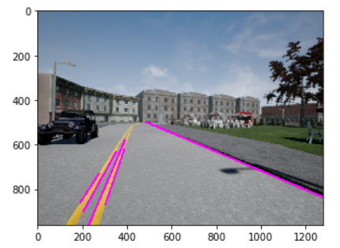

- 找到最近两条

```python
max_y = dataset_handler.image.shape[0]
min_y = np.min(np.argwhere(road_mask == 1)[:, 0])  # 通过只提取路面的mask来获得最远端位置
# print(max_y, min_y)
extrapolated_lanes = extrapolate_lines(merged_lane_lines, max_y, min_y)
print(extrapolated_lanes)
 #最后五条直线，通过比对与中心点的距离，然后找离中心点最近的两条
final_lanes = find_closest_lines(extrapolated_lanes, dataset_handler.lane_midpoint)
print("final lines: " + str(final_lanes))
plt.imshow(dataset_handler.vis_lanes(final_lanes))
```

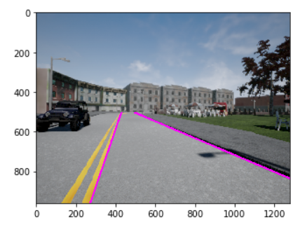

- 路面车辆检测

路面车辆流程如下：

物体识别--》找出是车的类型--》对检测框内所有像素进行深度估计--》找到最短距离

```python
# Graded Function: find_min_distance_to_detection:
def find_min_distance_to_detection(detections, x, y, z):
    """
    Filter 2D detection output based on a semantic segmentation map.

    Arguments:
    detections -- tensor of dimension (N, 5) containing detections in the form of [Class, x_min, y_min, x_max, y_max, score].
    
    x -- tensor of dimension (H, W) containing the x coordinates of every pixel in the camera coordinate frame.
    y -- tensor of dimension (H, W) containing the y coordinates of every pixel in the camera coordinate frame.
    z -- tensor of dimensions (H,W) containing the z coordinates of every pixel in the camera coordinate frame.
    Returns:
    min_distances -- tensor of dimension (N, 1) containing distance to impact with every object in the scene.

    """
    ### START CODE HERE ### (≈ 20 lines in total)
    min_distances = np.array([])
    for detection in detections:
        distance = np.inf
        coordinate = np.asfarray(detection[1:]).astype(int)
#         print(coordinate)
        x_min, y_min, x_max, y_max = coordinate[0], coordinate[1], coordinate[2], coordinate[3]
        # Step 1: Compute distance of every pixel in the detection bounds
        for v in range(x_min, x_max + 1):
            for h in range(y_min, y_max + 1):
                distance = min(np.sqrt(x[h, v] ** 2 + y[h, v] ** 2 + z[h, v] ** 2), distance)
        # Step 2: Find minimum distance
        min_distances = np.append(min_distances, distance)
#         print(min_distances)
    ### END CODE HERE ###
    return min_distances


```

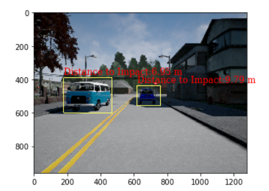


## 四、运动规划

运动规划主要分三个部分

1. 地图构建，地图一般有两种表现形式--栅格地图和高精度地图
2. 运动预测，预测自身车辆的行驶路径，所占面积，与运动的车辆发生碰撞的假设时间
3. 行为规划，包含追踪速度，跟随前车，刹车停止，停止启动这几个状态

4. 局部规划，主要涉及路径传播，短期路径规划的问题

### 4.1 地图构建

这里提供一个二维栅格地图构建的方案：Inverse measurement model

栅格地图将会收集雷达数据，然后以概率的形式展现，概率越低表示可行性越高

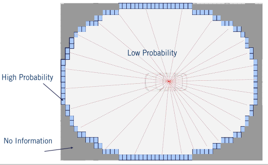

计算方法如下：

用r，Φ表示Lidar的测试距离和角度，k表示最小的扫描夹角范围

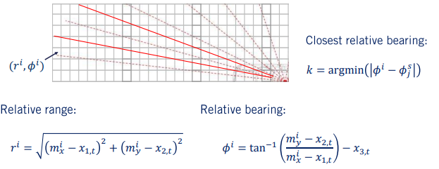

α：大概率为物体的区域

β：扫描到的夹角

用以下三条约束表示可行域，障碍区域，未知区域

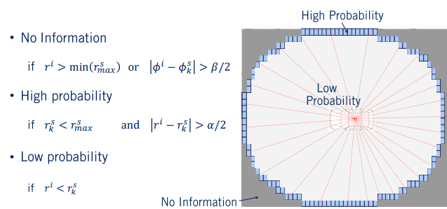

光线追踪法探索可行域（加快计算速度）：（这个方法其实就是通过固定角度，从近到远更新信息）

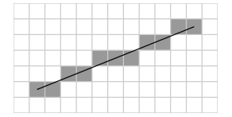

```python
# Calculates the inverse measurement model for a laser scanner.
# It identifies three regions. The first where no information is available occurs
# outside of the scanning arc. The second where objects are likely to exist, at the
# end of the range measurement within the arc. The third are where objects are unlikely
# to exist, within the arc but with less distance than the range measurement.
def inverse_scanner(num_rows, num_cols, x, y, theta, meas_phi, meas_r, rmax, alpha, beta):
    m = np.zeros((M, N))
    for i in range(num_rows):
        for j in range(num_cols):
            # Find range and bearing relative to the input state (x, y, theta).
            r = math.sqrt((i - x)**2 + (j - y)**2)
            phi = (math.atan2(j - y, i - x) - theta + math.pi) % (2 * math.pi) - math.pi
            
            # Find the range measurement associated with the relative bearing.
            k = np.argmin(np.abs(np.subtract(phi, meas_phi)))
            
            # If the range is greater than the maximum sensor range, or behind our range
            # measurement, or is outside of the field of view of the sensor, then no
            # new information is available.
            if (r > min(rmax, meas_r[k] + alpha / 2.0)) or (abs(phi - meas_phi[k]) > beta / 2.0):
                m[i, j] = 0.5
            
            # If the range measurement lied within this cell, it is likely to be an object.
            elif (meas_r[k] < rmax) and (abs(r - meas_r[k]) < alpha / 2.0):
                m[i, j] = 0.7
            
            # If the cell is in front of the range measurement, it is likely to be empty.
            elif r < meas_r[k]:
                m[i, j] = 0.3
                
    return m


##光线追踪法构建可行域
# Generates range measurements for a laser scanner based on a map, vehicle position,
# and sensor parameters.
# Uses the ray tracing algorithm.
def get_ranges(true_map, X, meas_phi, rmax):
    (M, N) = np.shape(true_map)
    x = X[0]
    y = X[1]
    theta = X[2]
    meas_r = rmax * np.ones(meas_phi.shape)
    
    # Iterate for each measurement bearing.
    for i in range(len(meas_phi)):
        # Iterate over each unit step up to and including rmax.
        for r in range(1, rmax+1):
            # Determine the coordinates of the cell.
            xi = int(round(x + r * math.cos(theta + meas_phi[i])))
            yi = int(round(y + r * math.sin(theta + meas_phi[i])))
            
            # If not in the map, set measurement there and stop going further.
            if (xi <= 0 or xi >= M-1 or yi <= 0 or yi >= N-1):
                meas_r[i] = r
                break
            # If in the map, but hitting an obstacle, set the measurement range
            # and stop ray tracing.
            elif true_map[int(round(xi)), int(round(yi))] == 1:
                meas_r[i] = r
                break
                
    return meas_r
```

效果：

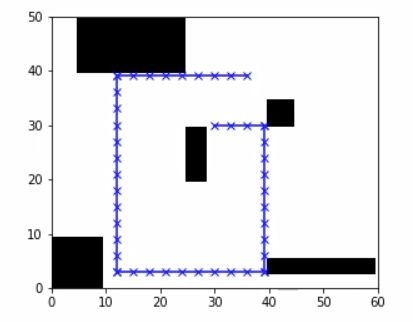

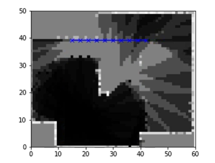

### 4.2 路径规划（Route planning）

[对dijkstra算法和A*算法的理解_a星算法和dijkstra_吃龙虾一样能吃饱的博客-CSDN博客](https://blog.csdn.net/qq_36013249/article/details/105554558?spm=1001.2101.3001.6650.1&utm_medium=distribute.pc_relevant.none-task-blog-2~default~CTRLIST~Rate-1-105554558-blog-93320180.235^v38^pc_relevant_anti_t3&depth_1-utm_source=distribute.pc_relevant.none-task-blog-2~default~CTRLIST~Rate-1-105554558-blog-93320180.235^v38^pc_relevant_anti_t3&utm_relevant_index=2)

路径规划算是汽车运动规划中第一个要考虑的问题，即点A->点B，应该怎么走最近，系统需要通过已知的地图，计算最优路径用于选择（就像高德地图那样）

Dijkastra算法：

广度优先搜索的加权版

数据结构为图，使用优先队列进行遍历

A*算法：

对于每个节点的评估加入启发式函数（heuristic function）,启发式函数是该节点与终点的一个函数联系，如果不加，就退化为Dijkastra

### 4.3 行为规划（behavior planning)

路径规划只是规划到了大路，对于具体的行车状况细节并不关心。考虑行车具体状况的规划叫做行为规划（behavior planning）

行为规划一般用有限状态机来描述，对应的驾驶场景很多，为了使得设计更加合理(以应付不同的驾驶场景)，会使用层次型的状态机（Hierarchical State Machine）

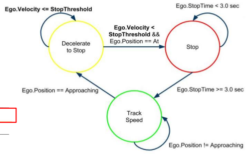

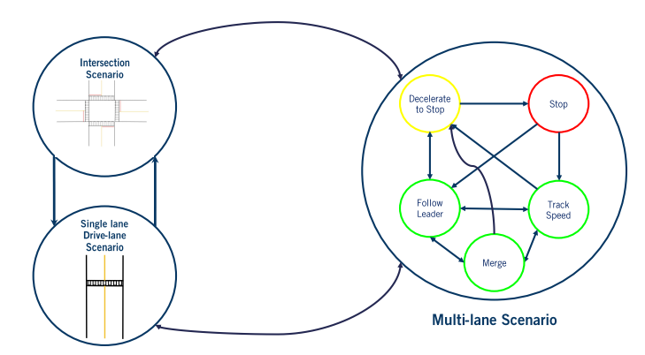

### 4.4 运动预测(轨迹预测、碰撞预测)


### 4.5 局部路径规划

Lattice planning是其中的一种局部路径规划算法，在此详解

Lattice算法：

- 从目标中心点偏移得到不同的目标点

- 生成车辆到目标点的多条路径（Simpson rule），梯形积分法离散路径
- 检查路径是否可行（运动学限制，碰撞检测）

### 4.6 运动规划代码

有限状态机的转换逻辑：

```python
# behaviour planner
if self._state == FOLLOW_LANE:
    # First, find the closest index to the ego vehicle.
    # TODO: INSERT YOUR CODE BETWEEN THE DASHED LINES
    # ------------------------------------------------------------------
    closest_len, closest_index = get_closest_index(waypoints, ego_state)
    # ------------------------------------------------------------------

    # Next, find the goal index that lies within the lookahead distance
    # along the waypoints.
    # TODO: INSERT YOUR CODE BETWEEN THE DASHED LINES
    # ------------------------------------------------------------------
    goal_index = self.get_goal_index(waypoints, ego_state, closest_len, closest_index)
    # ------------------------------------------------------------------

    # Finally, check the index set between closest_index and goal_index
    # for stop signs, and compute the goal state accordingly.
    # TODO: INSERT YOUR CODE BETWEEN THE DASHED LINES
    # ------------------------------------------------------------------
    goal_index, stop_sign_found = self.check_for_stop_signs(waypoints, closest_index, goal_index)
    self._goal_index = goal_index
    self._goal_state = waypoints[goal_index]
    # ------------------------------------------------------------------

    # If stop sign found, set the goal to zero speed, then transition to 
    # the deceleration state.
    # TODO: INSERT YOUR CODE BETWEEN THE DASHED LINES
    # ------------------------------------------------------------------
    if stop_sign_found:
        self._stopsign_index = goal_index
    #   self._goal_state[2] = 0
        self._state = DECELERATE_TO_STOP
    # ------------------------------------------------------------------

    # pass

# In this state, check if we have reached a complete stop. Use the
# closed loop speed to do so, to ensure we are actually at a complete
# stop, and compare to STOP_THRESHOLD.  If so, transition to the next
# state.
elif self._state == DECELERATE_TO_STOP:
    # TODO: INSERT YOUR CODE BETWEEN THE DASHED LINES
    # ------------------------------------------------------------------
    if closed_loop_speed <= STOP_THRESHOLD:
        self._state = STAY_STOPPED
        self._stop_count = 0
    # ------------------------------------------------------------------

    # pass

# In this state, check to see if we have stayed stopped for at
# least STOP_COUNTS number of cycles. If so, we can now leave
# the stop sign and transition to the next state.
elif self._state == STAY_STOPPED:
    # We have stayed stopped for the required number of cycles.
    # Allow the ego vehicle to leave the stop sign. Once it has
    # passed the stop sign, return to lane following.
    # You should use the get_closest_index(), get_goal_index(), and 
    # check_for_stop_signs() helper functions.
    if self._stop_count == STOP_COUNTS:
        # TODO: INSERT YOUR CODE BETWEEN THE DASHED LINES
        # --------------------------------------------------------------
        closest_len, closest_index = get_closest_index(waypoints, ego_state)
        goal_index = self.get_goal_index(waypoints, ego_state, closest_len, closest_index)
        # while waypoints[goal_index][2] <= 0.1: goal_index += 1
        # DC
        # --------------------------------------------------------------

        # We've stopped for the required amount of time, so the new goal 
        # index for the stop line is not relevant. Use the goal index
        # that is the lookahead distance away.
        # TODO: INSERT YOUR CODE BETWEEN THE DASHED LINES
        # --------------------------------------------------------------
        # DC
        stop_sign_found = False
        self._goal_index = goal_index
        self._goal_state = waypoints[goal_index]
        # --------------------------------------------------------------

        # If the stop sign is no longer along our path, we can now
        # transition back to our lane following state.
        # TODO: INSERT YOUR CODE BETWEEN THE DASHED LINES
        # --------------------------------------------------------------
        if not stop_sign_found:
            self._state = FOLLOW_LANE
            # self._stop_count = 0
        # --------------------------------------------------------------

        # pass

    # Otherwise, continue counting.
    else:
        # TODO: INSERT YOUR CODE BETWEEN THE DASHED LINES
        # --------------------------------------------------------------
        self._stop_count += 1
        # --------------------------------------------------------------

        # pass
else:
    raise ValueError('Invalid state value.')
    
    
    
## 汽车目视距离的waypoint坐标更新
while wp_index < len(waypoints) - 1:
    current  =  np.array([waypoints[wp_index][0], waypoints[wp_index][1]])
    next     =  np.array([waypoints[wp_index + 1][0], waypoints[wp_index + 1][1]])
    arc_length += np.linalg.norm(current - next)
    if arc_length > self._lookahead:
        return wp_index ## 增补代码v1
    wp_index += 1

```

最近距离waypoint坐标提取

```python
def get_closest_index(waypoints, ego_state):
    """Gets closest index a given list of waypoints to the vehicle position.

    args:
        waypoints: current waypoints to track. (global frame)
            length and speed in m and m/s.
            (includes speed to track at each x,y location.)
            format: [[x0, y0, v0],
                     [x1, y1, v1],
                     ...
                     [xn, yn, vn]]
            example:
                waypoints[2][1]: 
                returns the 3rd waypoint's y position

                waypoints[5]:
                returns [x5, y5, v5] (6th waypoint)
        ego_state: ego state vector for the vehicle. (global frame)
            format: [ego_x, ego_y, ego_yaw, ego_open_loop_speed]
                ego_x and ego_y     : position (m)
                ego_yaw             : top-down orientation [-pi to pi]
                ego_open_loop_speed : open loop speed (m/s)

    returns:
        [closest_len, closest_index]:
            closest_len: length (m) to the closest waypoint from the vehicle.
            closest_index: index of the waypoint which is closest to the vehicle.
                i.e. waypoints[closest_index] gives the waypoint closest to the vehicle.
    """
    closest_len = float('Inf')
    closest_index = 0
    # TODO: INSERT YOUR CODE BETWEEN THE DASHED LINES
    # ------------------------------------------------------------------
    for i in range(len(waypoints)):
        ego_point = np.array([ego_state[0], ego_state[1]])
        waypoint  = np.array([waypoints[i][0], waypoints[i][1]])
        distance  = np.linalg.norm(ego_point - waypoint)
        if distance <= closest_len:
            closest_len   = distance
            closest_index = i
    # ------------------------------------------------------------------

    return closest_len, closest_index
```

碰撞检测中，圆心位置计算：

```python
circle_locations = np.zeros((len(self._circle_offsets), 2))

# TODO: INSERT YOUR CODE BETWEEN THE DASHED LINES
# --------------------------------------------------------------
circle_locations[:, 0] = [i * int(np.cos(path[2][j])) for i in self._circle_offsets] + path[0][j]
circle_locations[:, 1] = [i * int(np.sin(path[2][j])) for i in self._circle_offsets] + path[1][j]
```

选择最优路径：

```python
def select_best_path_index(self, paths, collision_check_array, goal_state):
    best_index = None
    best_score = float('Inf')
    for i in range(len(paths)):
        if collision_check_array[i]:
            #计算欧氏距离，越小越好
            score = np.sqrt((goal_state[0] - paths[i][0][len(paths[i][0])-1])**2 + (goal_state[1] - paths[i][1][len(paths[i][0])-1])**2)
            # Compute the "proximity to other colliding paths" score and
            # add it to the "distance from centerline" score.
            # The exact choice of objective function is up to you.
            for j in range(len(paths)):
                if j == i:
                    continue
                else:#有碰撞，直接加一个大数以忽略该路径
                    if not collision_check_array[j]:
                        print("Adding score")
                        score += self._weight * paths[i][2][j]
        # Handle the case of colliding paths.
        else:
            score = float('Inf')

        print("score = %f" % score)
            
        # Set the best index to be the path index with the lowest score
        if score < best_score:
            best_score = score
            best_index = i

    print("--------------------")

    return best_index
```

路径目标点集生成：

```python
    def get_goal_state_set(self, goal_index, goal_state, waypoints, ego_state):
        """Gets the goal states given a goal position.
        
        Gets the goal states given a goal position. The states 

        args:
            goal_index: Goal index for the vehicle to reach
                i.e. waypoints[goal_index] gives the goal waypoint
            goal_state: Goal state for the vehicle to reach (global frame)
                format: [x_goal, y_goal, v_goal], in units [m, m, m/s]
            waypoints: current waypoints to track. length and speed in m and m/s.
                (includes speed to track at each x,y location.) (global frame)
                format: [[x0, y0, v0],
                         [x1, y1, v1],
                         ...
                         [xn, yn, vn]]
                example:
                    waypoints[2][1]: 
                    returns the 3rd waypoint's y position

                    waypoints[5]:
                    returns [x5, y5, v5] (6th waypoint)
            ego_state: ego state vector for the vehicle, in the global frame.
                format: [ego_x, ego_y, ego_yaw, ego_open_loop_speed]
                    ego_x and ego_y     : position (m)
                    ego_yaw             : top-down orientation [-pi to pi]
                    ego_open_loop_speed : open loop speed (m/s)
        returns:
            goal_state_set: Set of goal states (offsetted laterally from one
                another) to be used by the local planner to plan multiple
                proposal paths. This goal state set is in the vehicle frame.
                format: [[x0, y0, t0, v0],
                         [x1, y1, t1, v1],
                         ...
                         [xm, ym, tm, vm]]
                , where m is the total number of goal states
                  [x, y, t] are the position and yaw values at each goal
                  v is the goal speed at the goal point.
                  all units are in m, m/s and radians
        """
        # Compute the final heading based on the next index.
        # If the goal index is the last in the set of waypoints, use
        # the previous index instead.
        # To do this, compute the delta_x and delta_y values between
        # consecutive waypoints, then use the np.arctan2() function.
        # TODO: INSERT YOUR CODE BETWEEN THE DASHED LINES
        # ------------------------------------------------------------------
        if goal_index != len(waypoints) - 1:
            delta_x = waypoints[goal_index + 1][0] - waypoints[goal_index][0]
            delta_y = waypoints[goal_index + 1][1] - waypoints[goal_index][1]
        else: 
            delta_x = waypoints[goal_index][0] - waypoints[goal_index -1][0]
            delta_y = waypoints[goal_index][1] - waypoints[goal_index -1][1]
        heading = np.arctan2(delta_y, delta_x)
        # ------------------------------------------------------------------

        # Compute the center goal state in the local frame using 
        # the ego state. The following code will transform the input
        # goal state to the ego vehicle's local frame.
        # The goal state will be of the form (x, y, t, v).
        goal_state_local = copy.copy(goal_state)

        # Translate so the ego state is at the origin in the new frame.
        # This is done by subtracting the ego_state from the goal_state_local.
        # TODO: INSERT YOUR CODE BETWEEN THE DASHED LINES
        # ------------------------------------------------------------------
        goal_state_local[0] -= ego_state[0] 
        goal_state_local[1] -= ego_state[1]
        # ------------------------------------------------------------------

        # Rotate such that the ego state has zero heading in the new frame.
        # Recall that the general rotation matrix is [cos(theta) -sin(theta)
        #                                             sin(theta)  cos(theta)]
        # and that we are rotating by -ego_state[2] to ensure the ego vehicle's
        # current yaw corresponds to theta = 0 in the new local frame.
        # TODO: INSERT YOUR CODE BETWEEN THE DASHED LINES
        # ------------------------------------------------------------------
        theta = -ego_state[2]
        goal_x = goal_state_local[0] * cos(theta) - goal_state_local[1] * sin(theta)
        goal_y = goal_state_local[0] * sin(theta) + goal_state_local[1] * cos(theta)
        # ------------------------------------------------------------------

        # Compute the goal yaw in the local frame by subtracting off the 
        # current ego yaw from the heading variable.
        # TODO: INSERT YOUR CODE BETWEEN THE DASHED LINES
        # ------------------------------------------------------------------
        goal_t = heading - ego_state[2]
        # ------------------------------------------------------------------

        # Velocity is preserved after the transformation.
        goal_v = goal_state[2]

        # Keep the goal heading within [-pi, pi] so the optimizer behaves well.
        if goal_t > pi:
            goal_t -= 2*pi
        elif goal_t < -pi:
            goal_t += 2*pi

        # Compute and apply the offset for each path such that
        # all of the paths have the same heading of the goal state, 
        # but are laterally offset with respect to the goal heading.
        goal_state_set = []
        for i in range(self._num_paths):
            # Compute offsets that span the number of paths set for the local
            # planner. Each offset goal will be used to generate a potential
            # path to be considered by the local planner.
            offset = (i - self._num_paths // 2) * self._path_offset

            # Compute the projection of the lateral offset along the x
            # and y axis. To do this, multiply the offset by cos(goal_theta + pi/2)
            # and sin(goal_theta + pi/2), respectively.
            # TODO: INSERT YOUR CODE BETWEEN THE DASHED LINES
            # ------------------------------------------------------------------
            x_offset = offset * cos(goal_t + pi/2)
            y_offset = offset * sin(goal_t + pi/2)
            # ------------------------------------------------------------------

            goal_state_set.append([goal_x + x_offset, 
                                   goal_y + y_offset, 
                                   goal_t, 
                                   goal_v])
           
        return goal_state_set  
```

用polynomial spiral optimization来生成路径

```python
    def plan_paths(self, goal_state_set):
        paths         = []
        path_validity = []
        for goal_state in goal_state_set:
            path = self._path_optimizer.optimize_spiral(goal_state[0], 
                                                        goal_state[1], 
                                                        goal_state[2])
            if np.linalg.norm([path[0][-1] - goal_state[0], 
                               path[1][-1] - goal_state[1], 
                               path[2][-1] - goal_state[2]]) > 0.1:
                path_validity.append(False)
            else:
                paths.append(path)
                path_validity.append(True)

        return paths, path_validity
```

优化路径：

```python
        res = scipy.optimize.minimize(  fun    = self.objective,
                                        x0     = p0, 
                                        method = 'L-BFGS-B',
                                        jac    = self.objective_grad,
                                        bounds = bounds,
                                        options= {'disp': True}
                                    )
        spiral = self.sample_spiral(res.x)
        return spiral
```

速度规划（略）
